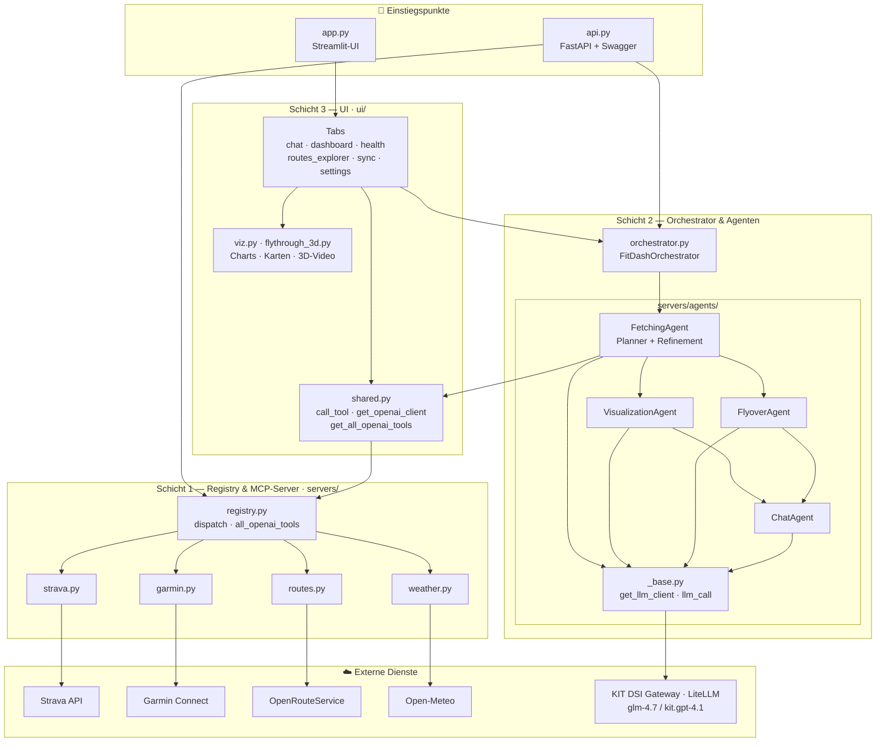
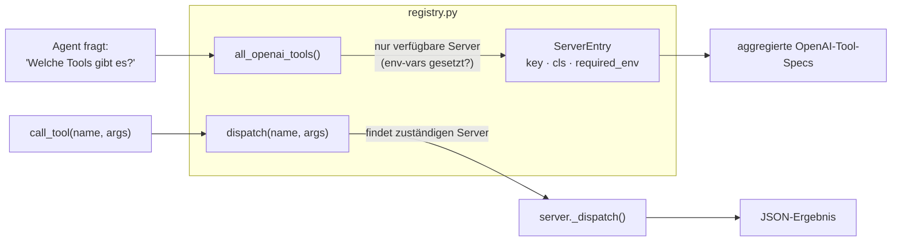

# FitDash — Architektur-Diagramme

Visuelle Ergänzung zu [`ARCHITECTURE.md`](ARCHITECTURE.md). Stand: `main` (4-Agenten-Pipeline).

> **Als SVG** (für Folien/Doku, editierbar) liegen die Diagramme unter [`diagrams/`](diagrams/):
> [`01_system_overview.svg`](diagrams/01_system_overview.svg) ·
> [`02_chat_flow.svg`](diagrams/02_chat_flow.svg) ·
> [`03_registry.svg`](diagrams/03_registry.svg).
> Die folgenden Mermaid-Blöcke sind dieselben Diagramme, live gerendert auf GitHub.

---

## 1. Systemübersicht (3 Schichten + externe Dienste)

**Schichtregel:** Jede Schicht kennt nur die darunter. MCP-Server wissen nichts vom Agenten,
der Agent nichts von der UI. Neue Datenquelle = neue Datei in `servers/` + 1 Zeile in `registry.py`.

---

## 2. Ablauf einer Chat-Anfrage (3 Phasen)

```mermaid
sequenceDiagram
    actor U as Nutzer
    participant UI as Chat-UI<br/>(ui/chat.py)
    participant O as Orchestrator
    participant F as FetchingAgent
    participant R as Registry → MCP-Server
    participant P as Viz ∥ Flyover
    participant C as ChatAgent
    participant L as LLM-Gateway

    U->>UI: Frage
    UI->>O: run(query, history)

    rect rgb(40,55,75)
    note over O,L: Phase 1 — Daten planen & abrufen
    O->>F: fetch(query, today, history)
    F->>L: Planner-Prompt (alle Tools)
    L-->>F: Tool-Plan (JSON)
    F->>R: Tool-Calls (parallel, ThreadPool)
    R-->>F: Daten (JSON)
    F-->>O: results · data_summary · key_findings
    end

    rect rgb(45,65,50)
    note over O,P: Phase 2 — Charts & Flythrough (parallel)
    O->>P: visualize ∥ flyover (regelbasiert, LLM nur bei Bedarf)
    P-->>O: viz_actions · flyover_action
    end

    rect rgb(70,55,40)
    note over O,L: Phase 3 — Antwort formulieren
    O->>C: synthesize(query, data, viz, flyover)
    C->>L: Antwort-Prompt
    L-->>C: Antworttext
    C-->>O: answer
    end

    O-->>UI: answer + trace
    UI-->>U: Antwort + Charts / Karte / 3D-Video
```

**Routing-Regeln (Phase 2):**
- `clarification_needed` oder alle Fetches fehlgeschlagen → Phase 2 übersprungen.
- Flythrough-Anfrage → nur FlyoverAgent (kein Chart-Rauschen, kein paralleler LLM-Burst).
- Normale Analytics-Frage → Viz + Flyover parallel.

---

## 3. Registry-Mechanik (automatische Tool-Erkennung)

Ein Server wird **automatisch** sichtbar, sobald er in `registry.py` registriert ist und seine
`required_env`-Variablen gesetzt sind — kein Eintrag in UI, Orchestrator oder `shared.py` nötig.

---

> **Variante auf Branch `feature/tool-use-loop`:** Dort sind Phase 1 + 3 zu einem **nativen
> Tool-Use-Loop** verschmolzen — das Modell wählt Tools selbst (`tool_choice="auto"`) und schreibt
> die Antwort im selben Agent. Planner, Refinement und separater ChatAgent entfallen. Noch ungetestet
> (Gateway-blockiert), daher nicht auf `main`.
